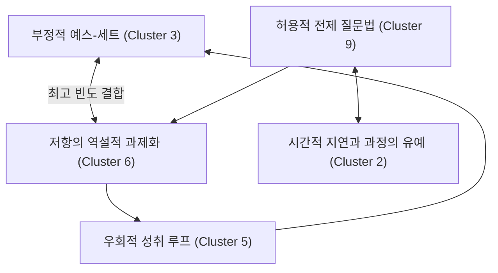

# 📊 밀턴 에릭슨 전략적 커뮤니케이션: 데이터 분석 총괄 리포트

> [!NOTE]
> 본 리포트는 마스터 클래스 1회차 도입부에서 **"왜 우리가 직관이 아닌 데이터를 믿어야 하는가?"**를 수강생들에게 설득하기 위해 작성된 '빅 픽처(Big Picture)' 데이터 브리핑 자료입니다. 총 **7,411건**의 에릭슨 발화 데이터를 다각도로 분석한 결과입니다.

---

## 1. 🗂️ 거시적 기법 카테고리 분포 (Macro Category Distribution)
에릭슨이 사용한 모든 기법을 대분류로 나누었을 때, 특정 기법들에 압도적인 비중이 실려 있음을 확인할 수 있습니다.

| 순위 | 카테고리명 (Category) | 샘플 수 | 비율(%) | 핵심 의미 |
| :--- | :--- | :--- | :--- | :--- |
| 1 | 기타 고유 기법 (Other Erickson Techniques) | 2928 | 39.51% | 라포 구축, 예스-세트 등 기초 공사 |
| 2 | **활용 (Utilization)** | **1716** | **23.15%** | **거부와 저항마저 자원으로 쓰는 에릭슨의 핵심 엔진** |
| 3 | 보조 맞추기와 보편적 사실 (Pacing & Truisms) | 925 | 12.48% | 뇌의 비판적 필터를 우회하는 무기 |
| 4 | 재구성 (Reframing) | 547 | 7.38% | 문제의 의미(Meaning)를 편집하는 기술 |
| 5 | 암시 기법 (Suggestions) | 438 | 5.91% | 직접 명령이 아닌 간접적 행동 촉구 |

---

## 2. 🧬 개별 언어 DNA(패턴) 최상위 분포 (Top 10 Micro Patterns)
수백 가지의 세부 기법 중, 에릭슨이 가장 빈번하게 꺼내 든 상위 10개의 '필살기'입니다.

| 순위 | 패턴 ID (언어적 DNA) | 빈도수 | 특징 |
| :--- | :--- | :--- | :--- |
| **1** | `ERICKSON_REFRAMING_UTILIZATION` | 89 | 상황을 재구성하여 즉각적으로 활용함 |
| **2** | `ERICKSON_UTILIZATION_REFRAMING` | 87 | 상대의 반응을 활용하여 새로운 의미 부여 |
| **3** | `ERICKSON_INDIRECT_SUGGESTION` | 84 | 우회적이고 부드러운 암시 (명령 회피) |
| **4** | `ERICKSON_CONSCIOUS_UNCONSCIOUS_DISSOCIATION` | 70 | "의식은 모릅니다. 무의식은 압니다" (해리) |
| **5** | `ERICKSON_DOUBLE_BIND` | 57 | "A를 하든 B를 하든" 목표로 이끄는 이중 구속 |
| **6** | `ERICKSON_UTILIZATION_TRUISM` | 57 | 부정할 수 없는 사실을 활용한 신뢰 구축 |
| **7** | `ERICKSON_PERMISSIVE_SUGGESTION` | 55 | "~해도 좋습니다" 형태의 허용적 암시 |
| **8** | `ERICKSON_PRESUPPOSITION` | 53 | 변화를 이미 기정사실화(전제)하는 화법 |
| **9** | `ERICKSON_UTILIZATION` | 52 | 기본 활용 기법 |
| **10** | `ERICKSON_TRUISM_PACING` | 49 | 보편적 사실에 상대의 호흡을 맞추는 기법 |

> [!IMPORTANT]
> 최상위 10개 패턴 중 무려 **4개**가 `UTILIZATION(활용)`과 관련된 패턴입니다. 이는 에릭슨 화법의 정수가 '상대의 반응을 역이용하는 것'에 있음을 데이터로 증명합니다.

---

## 3. 🔗 거시적 토폴로지: 전략의 연쇄 고리 (Strategy Transitions)
에릭슨은 단일 기법을 쓰지 않습니다. 항상 2~3개의 기법을 콤보(Combo)로 연결합니다.

### 🔄 Top 전략 바이그램 (2-Step Combos)
가장 높은 확률로 이어지는 두 기법의 조합입니다.
1. **[부정적 예스-세트] ⇄ [저항의 역설적 과제화]** (가장 강력한 루프, 빈도 127/116)
   - *해석*: 상대가 거부할 때(부정적 예스-세트), 그 거부하는 행동 자체를 숙제로 내어주어(역설적 과제화) 통제권을 가져오는 콤보.
2. **[허용적 전제 질문법] ➔ [시간적 지연과 과정의 유예]** (빈도 89)
   - *해석*: 빠져나갈 수 없는 질문을 던진 뒤, 대답을 늦추어 무의식적 탐색 시간을 강제 확보하는 콤보.
3. **[저항의 역설적 과제화] ➔ [우회적 성취 루프]** (빈도 89)

### 📈 전략 전환 흐름도 (Macro Flow)

---

## 4. 🎵 리듬과 밀도 분석 (Rhythm & Density Analysis)
에릭슨이 '호흡(문장 길이)'과 '침묵(쉼표)'을 전략적으로 어떻게 통제했는지에 대한 NLP 분석 결과입니다.

### 🗣️ 문장의 호흡 길이 (Words per Sentence)
*   **가장 긴 호흡 (만연체)**: `학술/역사적 닻 내리기` (16.00 단어/문장) -> 권위를 세우고 상대를 압도할 때.
*   **가장 짧은 호흡 (단타형)**: `시간적 지연과 과정의 유예` (6.29 단어/문장) -> 짧은 문장으로 상대의 뇌리에 메시지를 강하게 박아 넣을 때.

### ⏱️ 의도적인 정지와 침묵 (Comma Density)
문장 중간중간 쉼표(,)를 남발하여 **머뭇거림과 최면적 응시 타임**을 유도하는 기법입니다.
*   **1위**: `결핍의 치명적 자산화` (100단어 당 5.72개의 쉼표)
*   **2위**: `문제의 기술적 해체` (100단어 당 5.43개의 쉼표)
*   *해석*: 아픈 곳을 찌르거나 논리를 해체할 때는 의도적으로 문장을 더듬고 끊어 말함으로써 상대의 무의식적 긴장감을 극대화했습니다.

### 🔗 "And(그리고)" 앵커: 비판 회피형 연사
문장을 마침표로 끝내지 않고 "And(그리고)"로 계속 이어붙여, 상대방이 **비판적으로 생각할 틈을 주지 않는** 기법입니다.
*   **1위**: `일상 감각의 메타포화` (비중 3.56%)
*   **2위**: `자아-무의식 해리 유도` (비중 2.92%)
*   *해석*: 은유를 들려주거나 해리를 유도할 때는 끊임없이 귓가에 속삭이는 폭포수 같은 화법을 사용했습니다.

---

> [!TIP]
> **1회차 강연 팁 (For Instructors)**: 이 데이터를 화면에 띄워두고, *"에릭슨은 천재적인 감각으로 최면을 건 것이 아닙니다. 그는 상대의 저항을 마주할 때 높은 확률로 '역설적 과제'를 부여했고, 긴 문장과 짧은 문장, 그리고 쉼표의 빈도를 상황에 맞게 수학적으로 조절한 커뮤니케이션 해커(Hacker)였습니다. 우리는 이번 8주 동안 이 데이터를 기반으로 한 해킹 코드를 배울 것입니다."* 라고 오프닝을 열어보세요.
