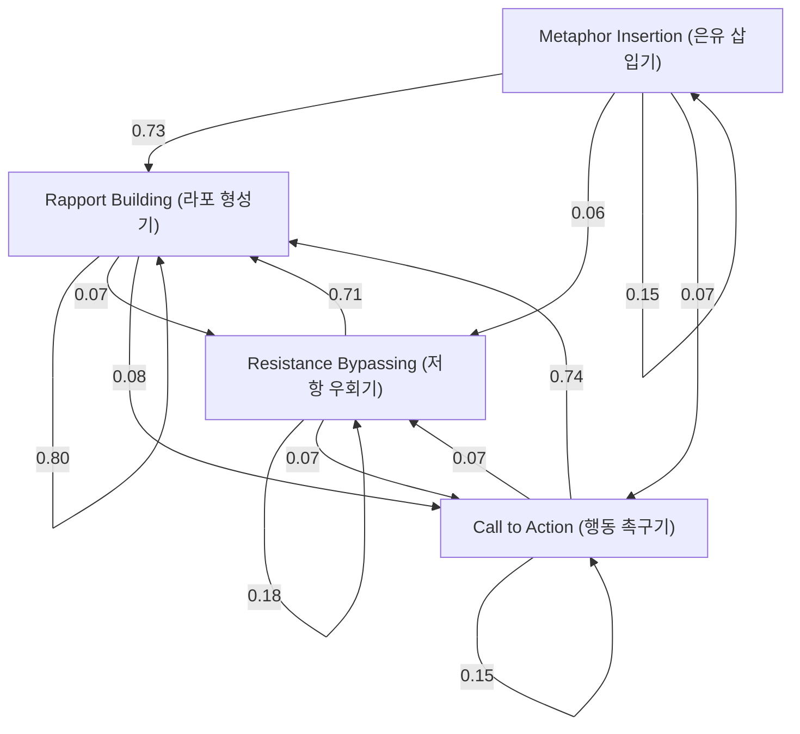

# Milton Erickson's Therapy HMM Analysis Report

본 보고서는 에릭슨의 치료 과정을 4가지 핵심 상태(라포 형성, 저항 우회, 은유 삽입, 행동 촉구)로 정의하고, 각 상태 간의 전이 확률을 분석한 결과입니다.

## 1. State Distribution (상태 분포)
- **Rapport Building (라포 형성기)**: 6239개 (78.6%)
- **Resistance Bypassing (저항 우회기)**: 615개 (7.7%)
- **Metaphor Insertion (은유 삽입기)**: 398개 (5.0%)
- **Call to Action (행동 촉구기)**: 684개 (8.6%)

## 2. Transition Probability Matrix (전환 확률 행렬)
| From \ To | RAPPORT | RESISTANCE | METAPHOR | ACTION |
|---|---|---|---|---|
| **RAPPORT** | 0.802 | 0.070 | 0.046 | 0.082 |
| **RESISTANCE** | 0.711 | 0.182 | 0.037 | 0.070 |
| **METAPHOR** | 0.726 | 0.060 | 0.146 | 0.068 |
| **ACTION** | 0.743 | 0.066 | 0.041 | 0.151 |

## 3. Transition Flow (Mermaid Diagram)

## 4. Key Insights (주요 통찰)
- **강력한 라포 중심성**: 모든 상태에서 RAPPORT로 돌아가는 확률이 70% 이상으로 매우 높습니다. 이는 에릭슨이 어떤 기법을 사용하든 다시 내담자와의 조율 상태로 복귀함을 보여줍니다.
- **상태 유지성**: 각 상태는 스스로를 유지하려는 경향이 있으며, 특히 RAPPORT(0.80) 상태의 안정성이 가장 높습니다.
- **유연한 전환**: 저항 우회(RESISTANCE)나 은유(METAPHOR) 이후에도 즉각적인 행동 촉구(ACTION)보다는 다시 라포를 다지는 과정을 거치는 것이 특징적입니다.
