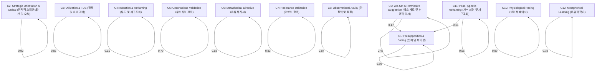

# Milton Erickson's Therapy: Unsupervised HMM Analysis Report

본 보고서는 12개의 클러스터링 기반 데이터를 사용하여 에릭슨의 치료 상태를 스스로 정의하고, 그들 사이의 전이 확률(Transition Probabilities)을 분석한 결과입니다.

## 1. Data-Driven State Distribution (상태 분포)
- Cluster 1 (**Presupposition & Pacing (전제 및 페이싱)**): 592개 (7.6%)
- Cluster 2 (**Strategic Orientation & Ordeal (전략적 오리엔테이션 및 오딜)**): 1244개 (16.0%)
- Cluster 3 (**Utilization & TDS (활용 및 내부 검색)**): 382개 (4.9%)
- Cluster 4 (**Induction & Reframing (유도 및 재구조화)**): 1561개 (20.1%)
- Cluster 5 (**Unconscious Validation (무의식적 검증)**): 321개 (4.1%)
- Cluster 6 (**Metaphorical Directive (은유적 지시)**): 57개 (0.7%)
- Cluster 7 (**Resistance Utilization (저항의 활용)**): 842개 (10.8%)
- Cluster 8 (**Observational Acuity (관찰력 및 통찰)**): 876개 (11.3%)
- Cluster 9 (**Yes-Set & Permissive Suggestion (예스 세트 및 허용적 암시)**): 228개 (2.9%)
- Cluster 10 (**Physiological Pacing (생리적 페이싱)**): 1029개 (13.2%)
- Cluster 11 (**Post-Hypnotic Reframing (사후 최면 및 재구조화)**): 371개 (4.8%)
- Cluster 12 (**Metaphorical Learning (은유적 학습)**): 269개 (3.5%)

## 2. Transition Probability Matrix
| From \ To | C1 | C2 | C3 | C4 | C5 | C6 | C7 | C8 | C9 | C10 | C11 | C12 |
|---|---|---|---|---|---|---|---|---|---|---|---|---|
| **C1** | 0.557 | 0.017 | 0.020 | 0.042 | 0.052 | 0.007 | 0.066 | 0.032 | 0.071 | 0.022 | 0.091 | 0.022 |
| **C2** | 0.010 | 0.924 | 0.002 | 0.009 | 0.003 | 0.001 | 0.010 | 0.011 | 0.007 | 0.011 | 0.009 | 0.002 |
| **C3** | 0.021 | 0.013 | 0.856 | 0.013 | 0.003 | 0.013 | 0.018 | 0.013 | 0.018 | 0.008 | 0.016 | 0.008 |
| **C4** | 0.016 | 0.008 | 0.005 | 0.914 | 0.006 | 0.002 | 0.008 | 0.009 | 0.007 | 0.012 | 0.010 | 0.003 |
| **C5** | 0.097 | 0.037 | 0.012 | 0.031 | 0.698 | 0.000 | 0.022 | 0.037 | 0.016 | 0.025 | 0.019 | 0.006 |
| **C6** | 0.035 | 0.000 | 0.035 | 0.070 | 0.035 | 0.579 | 0.035 | 0.035 | 0.018 | 0.070 | 0.053 | 0.035 |
| **C7** | 0.050 | 0.014 | 0.004 | 0.013 | 0.013 | 0.004 | 0.833 | 0.013 | 0.012 | 0.011 | 0.029 | 0.006 |
| **C8** | 0.013 | 0.014 | 0.006 | 0.026 | 0.009 | 0.002 | 0.014 | 0.870 | 0.008 | 0.019 | 0.014 | 0.006 |
| **C9** | 0.171 | 0.035 | 0.022 | 0.044 | 0.053 | 0.000 | 0.044 | 0.018 | 0.482 | 0.022 | 0.075 | 0.035 |
| **C10** | 0.016 | 0.008 | 0.005 | 0.013 | 0.011 | 0.001 | 0.009 | 0.015 | 0.008 | 0.901 | 0.007 | 0.009 |
| **C11** | 0.151 | 0.027 | 0.011 | 0.043 | 0.022 | 0.011 | 0.065 | 0.035 | 0.040 | 0.019 | 0.563 | 0.013 |
| **C12** | 0.074 | 0.022 | 0.015 | 0.022 | 0.000 | 0.004 | 0.022 | 0.019 | 0.011 | 0.011 | 0.022 | 0.777 |

## 3. Transition Flow (Mermaid Diagram - Top Transitions)

## 4. Summary of Observed Patterns (주요 패턴 관찰)
- **상태 지속성**: 많은 클러스터가 자기 자신으로 전이될 확률(Self-transition)이 높게 나타납니다. 이는 에릭슨이 특정 심리 프레임을 설정하면 한동안 그 상태를 유지하며 암시를 강화함을 의미합니다.
- **복합적 전이**: 사전 정의된 상태보다 훨씬 더 세밀한 전이 패턴이 나타나며, 특히 특정 '유도(Induction)' 상태에서 '재구조화(Reframing)'로 이어지는 브릿지 패턴들이 관찰됩니다.
